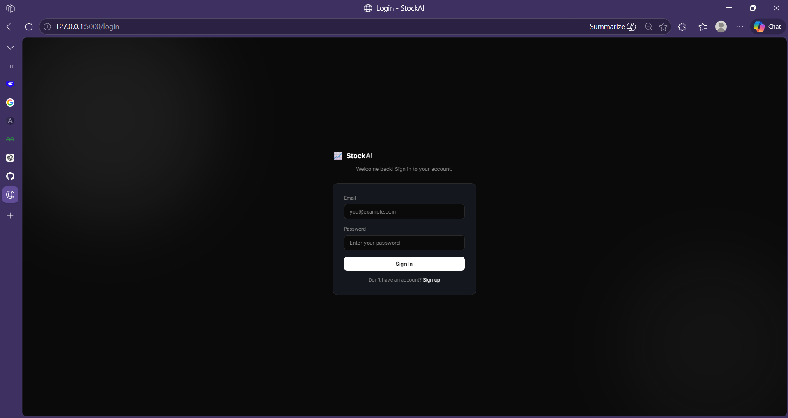
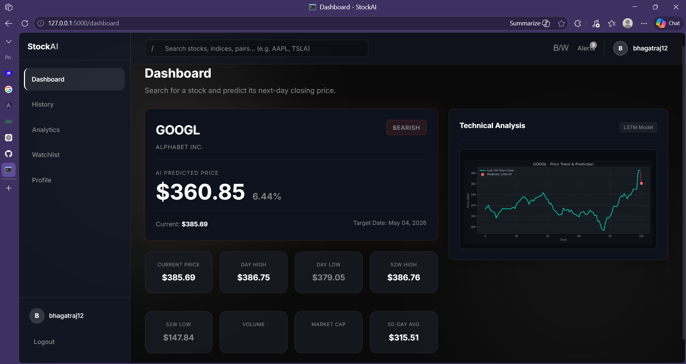
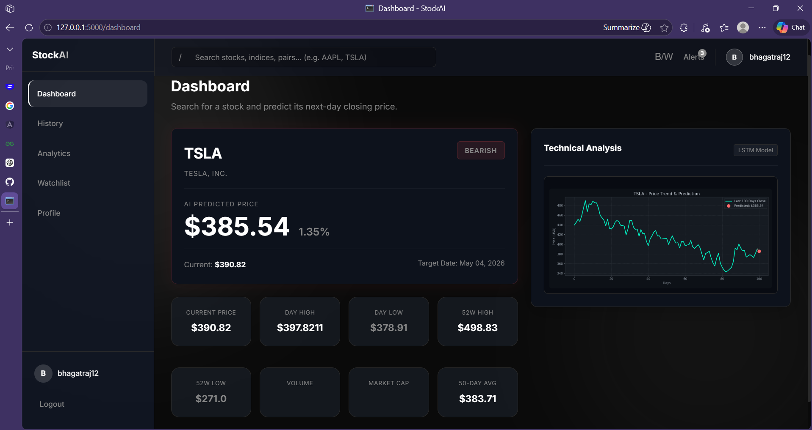
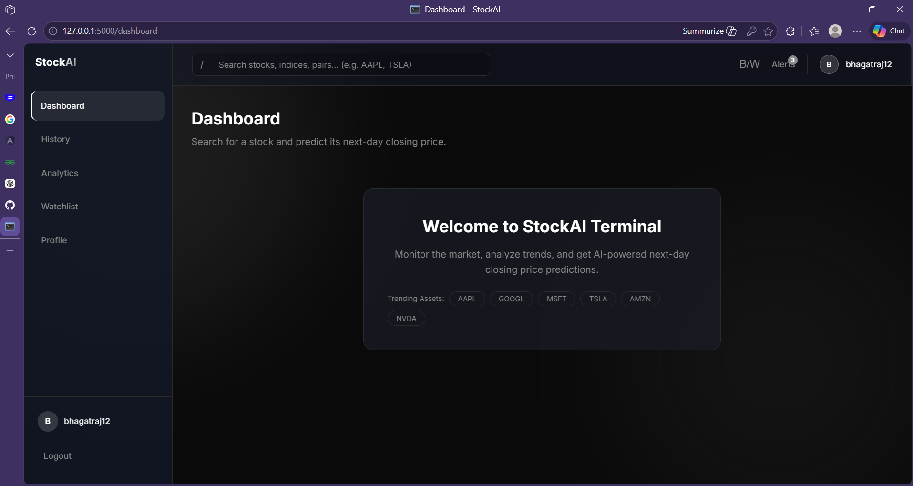
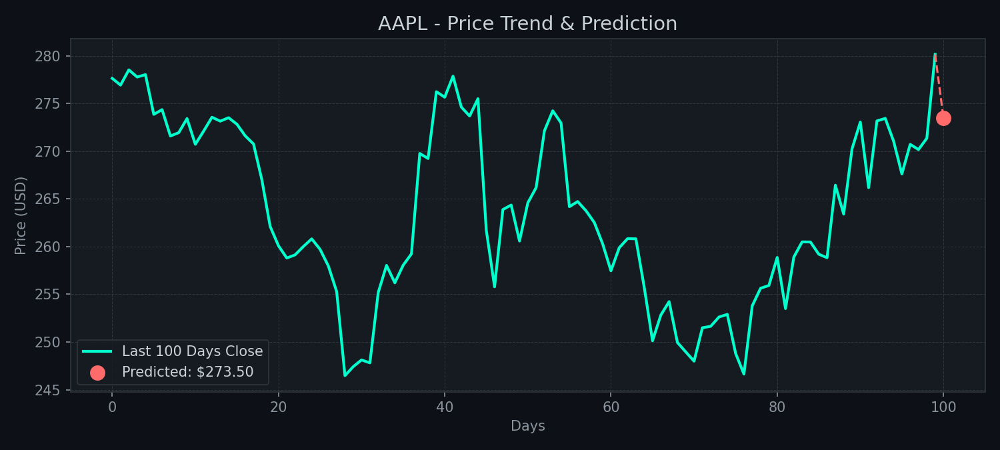
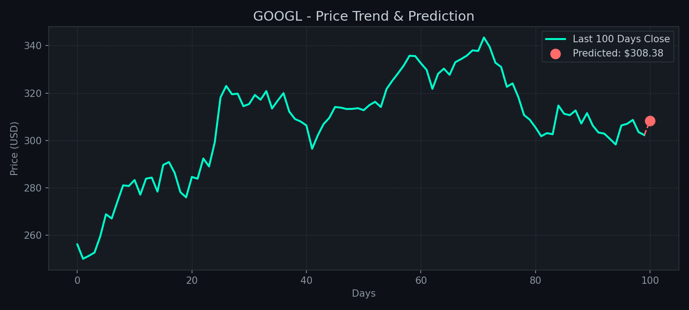
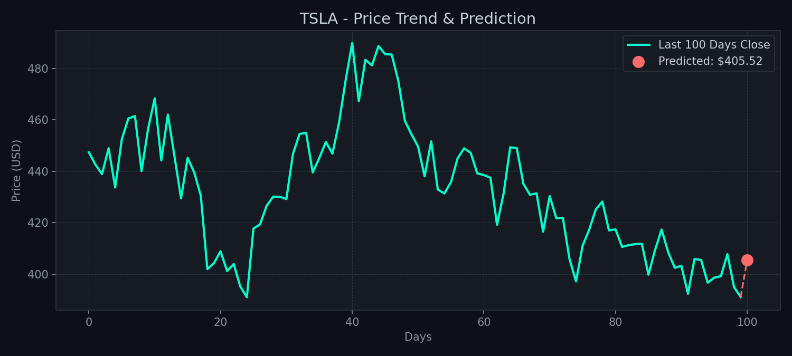

# Stock-Price-Prediction-Using-LSTM-ANN-
This Project Generally Predicts The Stock Price In Real Time Using Machine Learning Algorithm LSTM(ANN) Long Short Term Memory 
## 📊 Stock Prediction Graphs

## 🖥️ Application Screenshots

### 🏠 Front Page

### 🔐 Login Page

### 📊 Stock Prediction Dashboard

### 📈 Prediction Result

### 📄 Details Page

## 📊 Stock Prediction Results

### 📈 AAPL Prediction

### 📈 GOOGL Prediction

### 📈 TSLA Prediction

